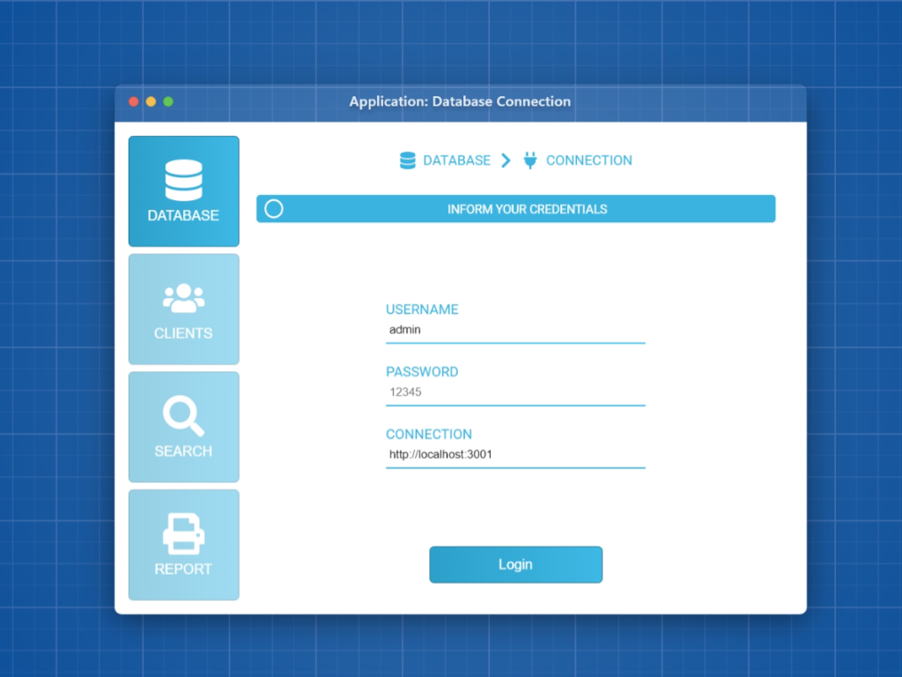

#  S1 | Teste Técnico - Fullstack
Entrega - Desafio: vaga Fullstack - JUNIOR
Projeto Fullstack apresentado à Kenzie Academy como requisito de avaliação parcial.



## Estrutura de pastas

    .
    ├── backend                     # Projeto Backend (Node.js)
    │   └── src          
    │       ├── controllers          
    │       ├── databases          
    │       ├── middlewares        
    │       ├── routers          
    │       ├── services         
    │       ├── app.js          
    │       └── ...                 # Demais arquivos de configuração
    ├── frontend
    │   └── blueprint               # Projeto Frontend (React.js e Redux)
    │       └── public
    │       └── src          
    │           ├── components          
    │           ├── pages         
    │           ├── redux
    │           ├── App.js          
    │           └── ...             # Demais arquivos de configuração
    └── README.md


## Instalação

Instale este projeto com Docker

```bash
  docker composer up --build
```
ou rode

```bash
  yarn install
```
para instalar cada projeto isoladamente da pastas "frontend/blueprint" e "backend".


## Documentação da API do Back-end

#### Retorna token de acesso do admin

```http
  POST /login
```

| Parâmetro   | Tipo       | Descrição                           |
| :---------- | :--------- | :---------------------------------- |
| `username` | `string` | **Obrigatório**. Username do admin |
| `password` | `string` | **Obrigatório**. Senha do admin |


#### Retorna todos os clientes (necessita de token)

```http
  GET /clients
```

#### Cria um cliente (necessita de token)

```http
  POST /clients
```

| Parâmetro   | Tipo       | Descrição                                   |
| :---------- | :--------- | :------------------------------------------ |
| `name`      | `string` | **Obrigatório**. Nome do cliente |
| `emails`      | `array de string` | **Obrigatório**. Emails |
| `phones`      | `array de string` | **Obrigatório**. Números de telefone |

#### Retorna info específica de um cliente (necessita de token)

```http
  GET /clients/:client_id
```

#### Atualiza info específica de um cliente (necessita de token)

```http
  PATCH /clients/:client_id
```

| Parâmetro   | Tipo       | Descrição                                   |
| :---------- | :--------- | :------------------------------------------ |
| `name`      | `string` | **Não nulo**. Nome do cliente |
| `emails`      | `array de string` | Emails |
| `phones`      | `array de string` | Números de telefone |


#### Lista os contatos de um determinado cliente (necessita de token)

```http
  GET /clients/:client_id/contacts
```

#### Cria um contato para um determinado cliente (necessita de token)

```http
  POST /clients/:client_id/contacts
```

| Parâmetro   | Tipo       | Descrição                                   |
| :---------- | :--------- | :------------------------------------------ |
| `name`      | `string` | **Obrigatório**. Nome do contato |
| `emails`      | `array de string` | **Obrigatório**. Emails |
| `phones`      | `array de string` | **Obrigatório**. Números de telefone |


#### Retorna info específica de um contato relacionado a um determinado cliente (necessita de token)

```http
  GET /clients/:client_id/contacts/:contact_id
```

#### Atualiza info específica de um contato relacionado a um determinado cliente (necessita de token)

```http
  PATCH /clients/:client_id/contacts/:contact_id
```

| Parâmetro   | Tipo       | Descrição                                   |
| :---------- | :--------- | :------------------------------------------ |
| `name`      | `string` | **Não nulo**. Nome do contato |
| `emails`      | `array de string` | Emails |
| `phones`      | `array de string` | Números de telefone |

#### Atualiza info específica de um cliente (necessita de token)

```http
  PATCH /clients/:client_id
```

#### Deleta um contato relacionado a um determinado cliente (necessita de token)

```http
  DELETE /clients/:client_id/contacts/:contact_id
```

